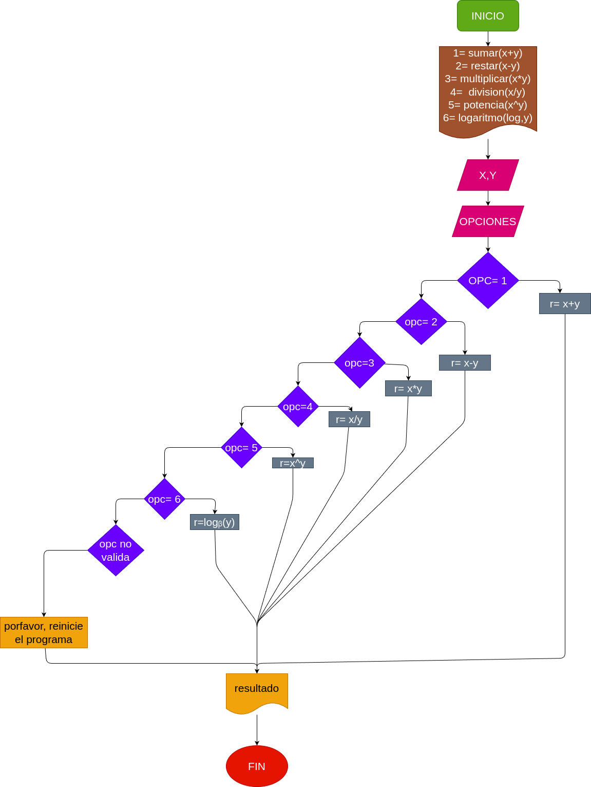

# minicalculadora_guanentina
una calculadora sencilla ejecutada desde la terminal.

## Input

X= primer digito
Y= segundo digito
R= resultado

## Proccesing

- 1= sumar(x+y)
- 2= restar(x-y)
- 3= multiplicar(x*y)
- 4=  division(x/y)
- 5= potencia(x^y)
- 6= logaritmo(log,y)

R= resultado de la opcion elegida

## Diseño

